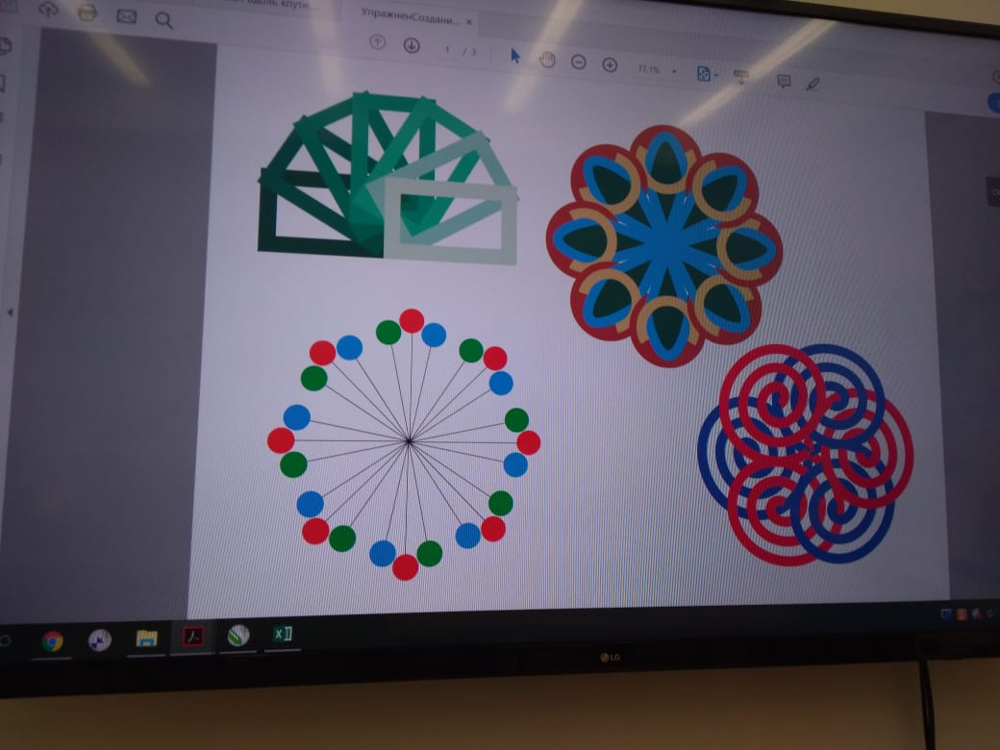

## Изображение №6

Все фигуры на этом изображении выполнены посредством [вращения некоторого объекта с дублированием.](#rotate)

### Фигура 1 — прямоугольники

Или:

#### Подробная инструкция:
В первую очередь — создать прямоугольник.  
«Горячая клавиша» инструмента «Прямоугольник» — F6.

Изменение толщины обводки фигуры:

Когда прямоугольник достаточных размеров создан, нужно выполнить вращение объекта с дублированием. В частном случае угол вращени каждой копии — -30°, а количество копий — 6. [Подробнее о параметрах инструмента.](#rotate-params)

Заключительный этап — изменения цвета обводки фигур.

Используй вкладку «Свойства объекта» в этой панели справа:

Здесь можно изменить и толщину обводки (первое поле), и её цвет (второе поле).

Для выполнения этого задания я бы использовал цветовую палитру HSB вместо RGB, чтобы градуально изменять цвет, изменяя параметр канала яркости B (V);

  

### Фигура 3

Навскидку, подходов к выполнению этого задания три, но я буду использовать тот, в котором не придётся работать с порядком слоёв.

  

### Фигура 4 — спирали

#### Подробная инструкция
«Спираль» («горячая клавиша» — A) на панели инструментов:

На отправленном тобой фото изображены правильные спирали. Чтобы их повторить, нужно удерживать *Ctrl*, пользуясь инструментом.

Для дублирования фигур я использовал параметры: **угол вращения** — -60°, **положение оси вращения** — средняя правая точка объекта, **количество копий** — 6.

Остаётся только изменить цвет их обводки.

## Инструмент вращения объекта с дублированием

Единственным способом воспользоваться этим инструментом, который я успел обнаружить, является доступ к нему на вкладке «Преобразования» в панели справа, названия которой я не знаю.

#### Подробная инструкция:
 

По умолчанию вкладки «Преобразования» в этой панели нет. Чтобы её добавить, нужно сперва нажать на «плюс», следующий за всеми вкладками панели — появится список всех доступных вкладок, — а затем кликнуть по чекбоксу напротив вкладки «Повернуть».

Появившаяся на панели вкладка:

#### Параметры инструмента вращения объекта с дублированием

**Первые пять пиктограмм** — тип преобразования, производимого над объектом. Выбрано «Вращение»  
**Поле с пиктограммой, символизирующей вращение** — угол вращения, cейчас равен нулю.  
**Координаты оси вращения объекта** — первые два поля для численного описания координат оси, а шесть пиктограмм ниже — для относительного.  
**Копии** — количество необходимых копий объекта. **Важно:** каждая копия будет повёрнута на N установленных выше градусов относительно текущей. То есть, если угол вращения объекта равен, скажем, тридцати, а количество копий — трём, то все они уместятся в девяносто градусов.
